# MBCTD — Multi-Label Building Change Type Detection

A deep learning model for per-pixel, multi-label detection of building changes in bi-temporal satellite and aerial imagery. MBCTD classifies each pixel independently into three change categories, allowing overlapping labels (e.g., a replacement site marked as both *demolished* and *new* simultaneously).

---

## Overview

Given a **before** image and an **after** image of the same geographic area, MBCTD produces per-pixel predictions for three classes:

| Class | Color | Meaning |
|---|---|---|
| **Unchanged** | 🔵 | Building present in both images |
| **Demolished** | 🔴 | Building present in *before*, absent in *after* |
| **New** | 🟢 | Building absent in *before*, present in *after* |
| **Replacement** *(demolished + new)* | 🟡 | Both demolished and new labels active simultaneously |

Because the model is **multi-label**, a single pixel can belong to more than one class. This makes it possible to represent complex urban transitions that single-label models cannot express.


### Inference samples

<details>
<summary><strong>LEVIR-CD+</strong></summary>

| | | | | |
|---|---|---|---|---|
| 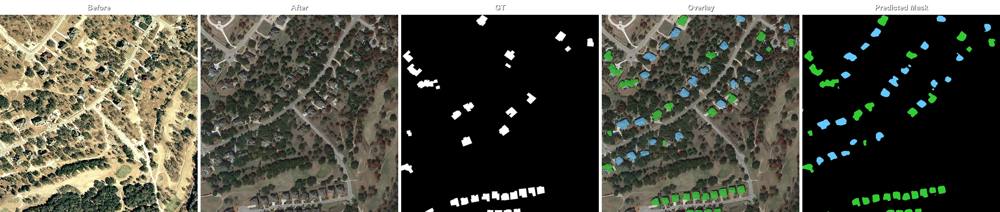 | 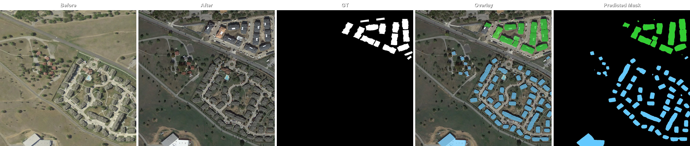 | 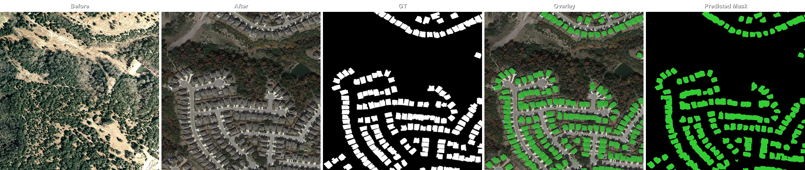 | 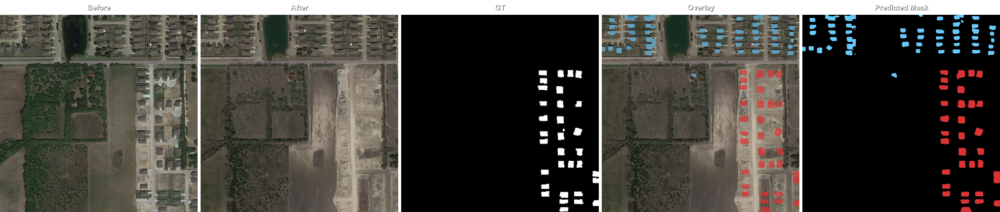 | 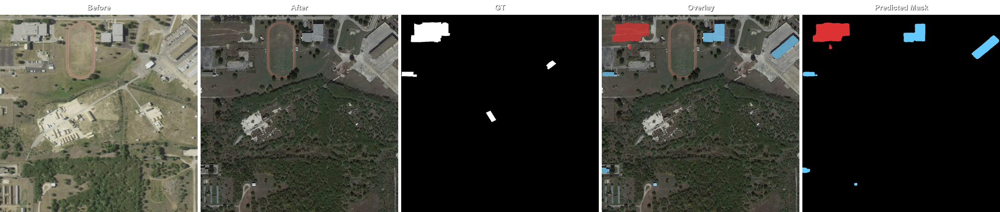 |
| 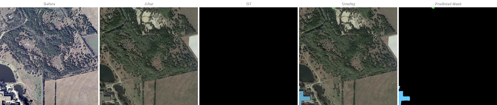 | 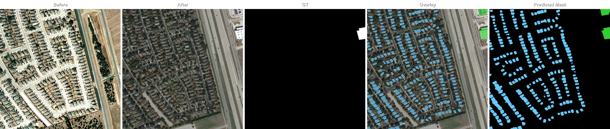 | 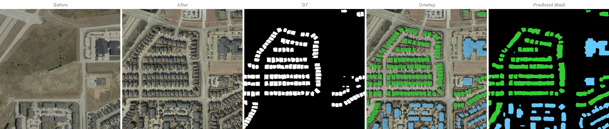 | 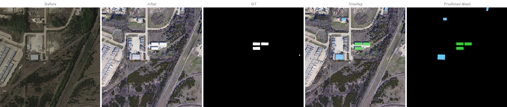 | 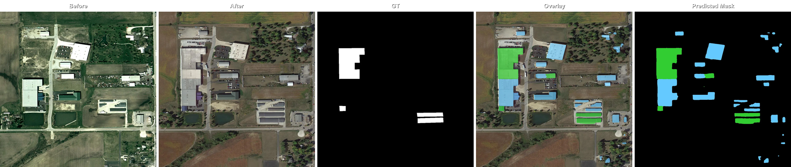 |

</details>

<details>
<summary><strong>FOTBCD</strong></summary>

| | | | | |
|---|---|---|---|---|
| 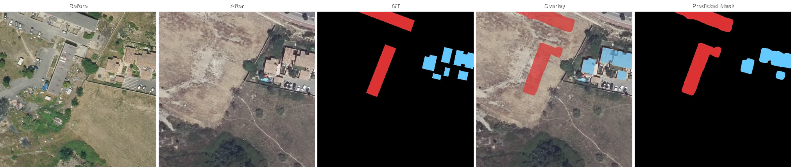 | 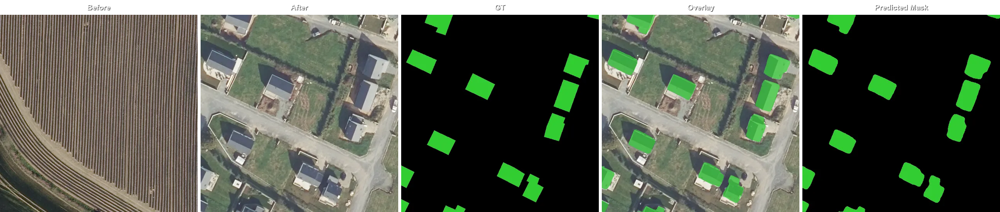 | 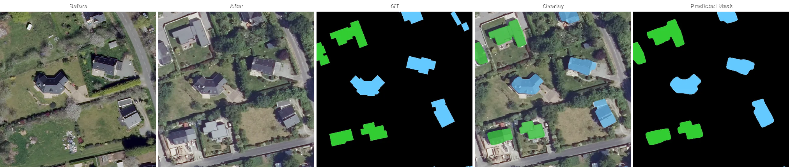 | 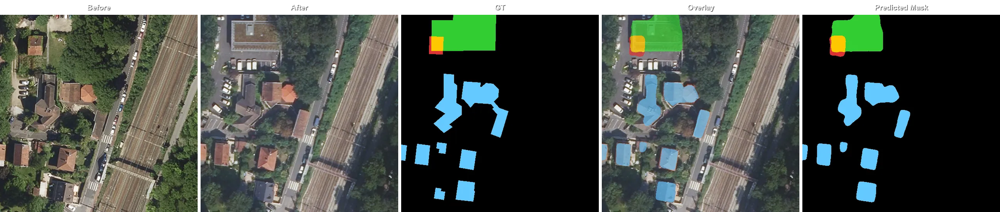 | 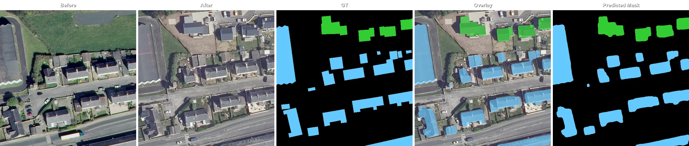 |
| 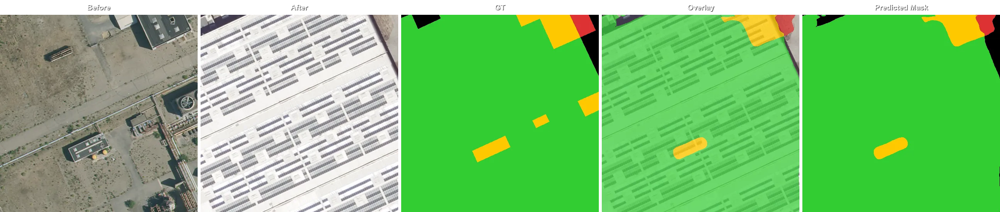 | 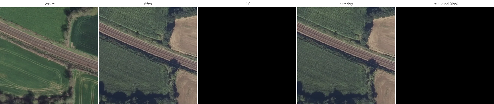 | 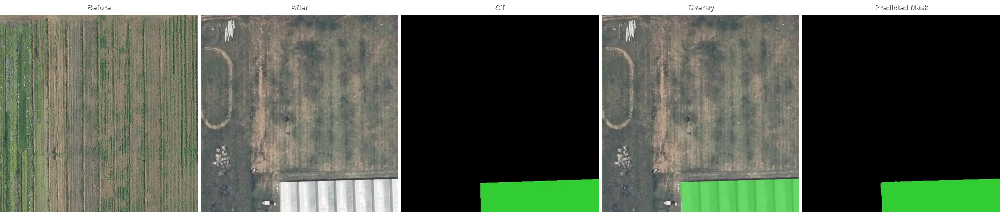 | 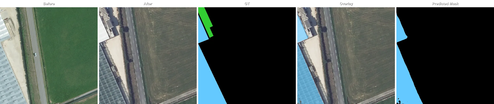 | 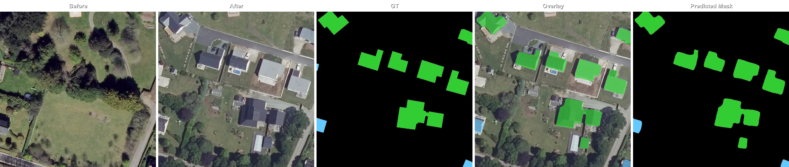 |
| 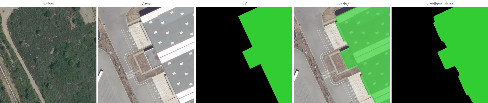 | 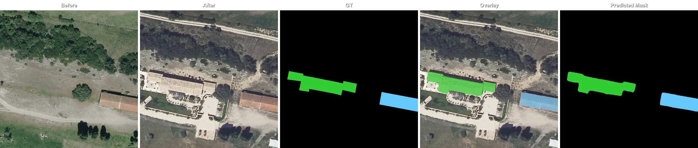 | | | |

</details>

---

## Architecture

MBCTD uses a **Siamese ConvNeXt-Base encoder** paired with a **full-resolution U-Net decoder**:

```
Before image ──┐
               ├─► Shared ConvNeXt-Base encoder ──► Change fusion at each scale
After image  ──┘                                           │
                                                           ▼
                                               Full-resolution U-Net decoder
                                               (PixelShuffle upsampling)
                                                           │
                                                           ▼
                                          3 independent sigmoid heads per pixel
```

**Key design decisions:**

- **Shared encoder weights** — the same ConvNeXt trunk processes both images, making the feature space comparable by construction.
- **Change fusion** — at each encoder scale, before/after features are combined as `[before, after, before−after, |before−after|]` and projected through 1×1→3×3 convolutions.
- **High-resolution skip connections** — in addition to encoder skips (1/32 → 1/4), raw input images are injected at 1/2 and 1/1 resolution to preserve fine-grained boundary information.
- **PixelShuffle upsampling** — learned upsampling at every decoder stage avoids checkerboard artifacts.
- **Pre-trained backbone** — ConvNeXt-Base initialised with DINOv3 LVD1689M weights.

---

## Project Structure

```
MBCTD/
├── model.py               # Model definition (encoder, fusion, decoder)
├── config.py              # MBCTDConfig dataclass
├── inference.py           # load_model, predict_patch, visualisation helpers
├── demo.py                # Interactive Gradio web demo
└── environment.yml        # Conda environment spec
```

---

## Installation

### 1. Clone the repository

```bash
git clone git@github.com:abdelpy/MBCTD
cd MBCTD
```

### 2. Create the Conda environment

```bash
conda env create -f environment.yml
conda activate mbctd
```

### 3. Install PyTorch

Follow the [official instructions](https://pytorch.org/get-started/locally/) to install PyTorch matching your CUDA version.

### 4. Download model weights

Pre-trained weights are available on [Google Drive](https://drive.google.com/drive/folders/1zukgSK9ASztaJzhWMnWrT7NJ7bh09_Uy?usp=sharing).

## Usage

### Interactive demo

The fastest way to try the model is the Gradio web interface:

```bash
python demo.py path/to/model.pth
```

Open the URL printed in your terminal. The UI lets you:

- Upload a **before** and **after** image pair
- Adjust the **confidence threshold** (0.1 – 0.9, default 0.7)
- Choose an **inference mode**:
  - `patch` — tile the image into 256 px patches and stitch predictions back (handles large images)
  - `full` — run at the image's original resolution
- Inspect the **overlay** on the after image, the **colour mask**, and per-class **pixel coverage statistics**

---

### Programmatic inference

```python
from PIL import Image
import numpy as np
import torch
from inference import load_model, predict_patch

device = torch.device("cuda" if torch.cuda.is_available() else "cpu")
model = load_model("model.pth", device)

# Load images as uint8 RGB numpy arrays
before = np.array(Image.open("before.png").convert("RGB"))
after  = np.array(Image.open("after.png").convert("RGB"))

result = predict_patch(before, after, model, threshold=0.7)
```

`predict_patch` returns a dictionary:

| Key | Shape | dtype | Description |
|---|---|---|---|
| `binary` | `(3, H, W)` | uint8 | Per-class binary masks (unchanged / demolished / new) |
| `class_map` | `(H, W)` | uint8 | Collapsed single-label class ID (0 = background, 1–4 = see colour table above) |
| `overlay` | `(H, W, 3)` | uint8 | Semi-transparent colour overlay drawn on the after image |
| `mask_rgb` | `(H, W, 3)` | uint8 | Solid-colour mask visualisation |
---

## Training

MBCTD was trained exclusively on **FOTBCD** — a large-scale, multi-label building change dataset — using 256 × 256 px patches drawn from over **220,000 before/after aerial image pairs** across France.

### FOTBCD — the dataset behind the model

FOTBCD is the first dataset with **multi-label building change annotations as vector polygons** covering demolished, new, and unchanged structures simultaneously. At 220k+ georeferenced pairs spanning diverse urban environments, it is an order of magnitude larger than existing change detection benchmarks — and the richness of its labels is what makes a model like MBCTD possible.

> **The dataset is available for licensing.**  
> Whether you are building an urban monitoring platform, a real-estate analytics product, or a geospatial AI pipeline, FOTBCD gives you the ground truth that generic benchmarks cannot provide. [Get in touch](mailto:info@retgen.ai) to discuss licensing terms.

---

## Results

Binary change detection metrics (demolished OR new → "changed") are reported for both benchmarks to enable comparison; LEVIR-CD+ provides only binary ground truth so no per-class breakdown is available for it. For FOTBCD, which supports multi-label annotations, per-class IoU is also reported.  
Inference threshold selected by best F1 on each benchmark.

### LEVIR-CD+  *(full-resolution inference, threshold = 0.75)*

| Metric | Value |
|---|---|
| Precision | 0.7694 |
| Recall | 0.8137 |
| F1 | 0.7909 |
| IoU change | 0.6541 |
| mIoU | 0.8180 |
| OA | 0.9825 |

### FOTBCD  *(full-resolution inference, threshold = 0.70)*

**Binary change detection**

| Metric | Value |
|---|---|
| Precision | 0.8948 |
| Recall | 0.9201 |
| F1 | 0.9073 |
| IoU change | 0.8303 |
| mIoU | 0.9094 |
| OA | 0.9891 |

**Per-class IoU**

| Class | IoU |
|---|---|
| Unchanged | 0.7774 |
| Demolished | 0.8166 |
| New | 0.8198 |

---

## License

This project is licensed under CC BY-NC 4.0
